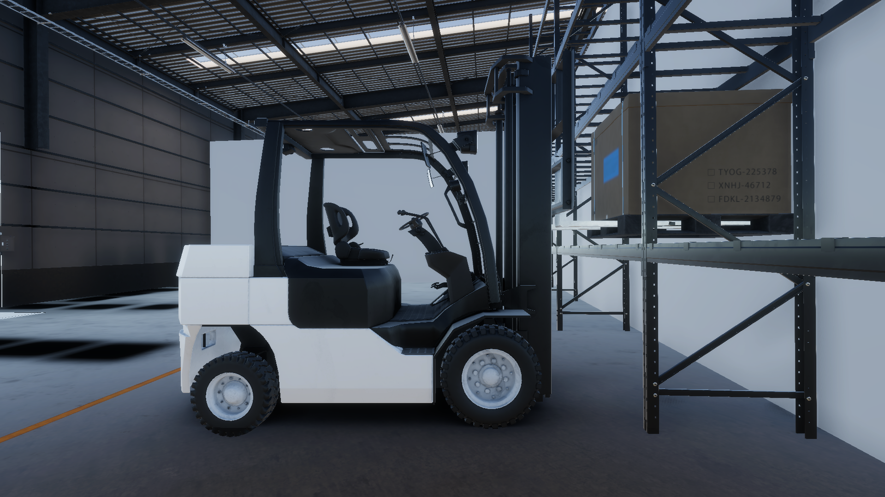
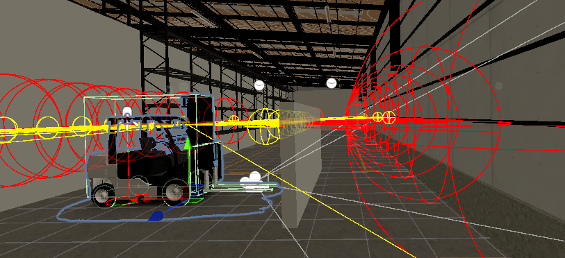
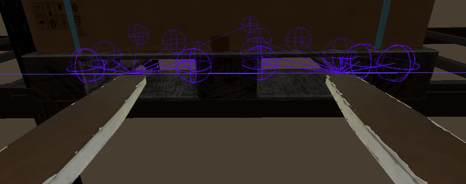
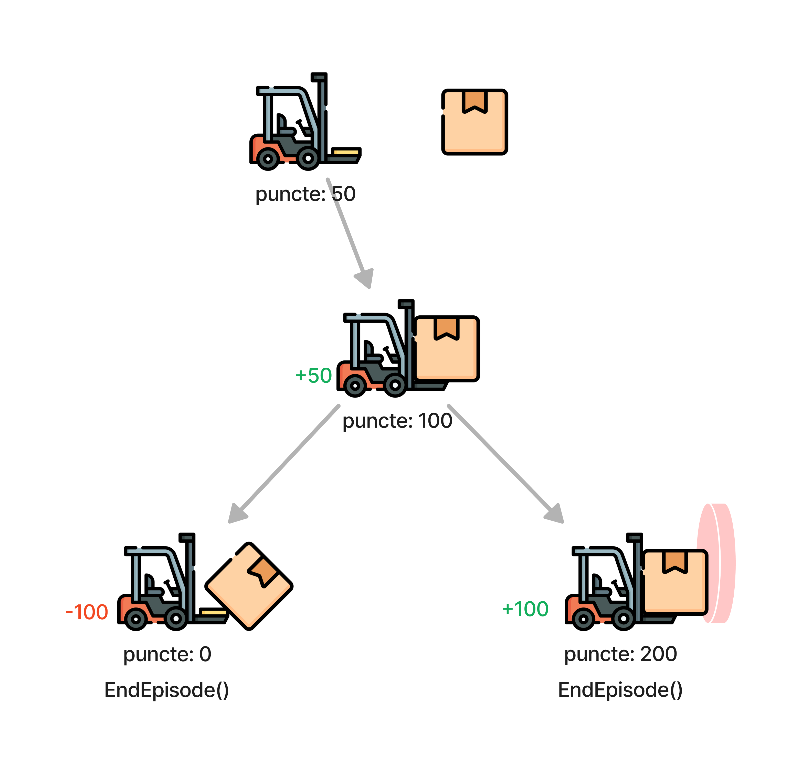
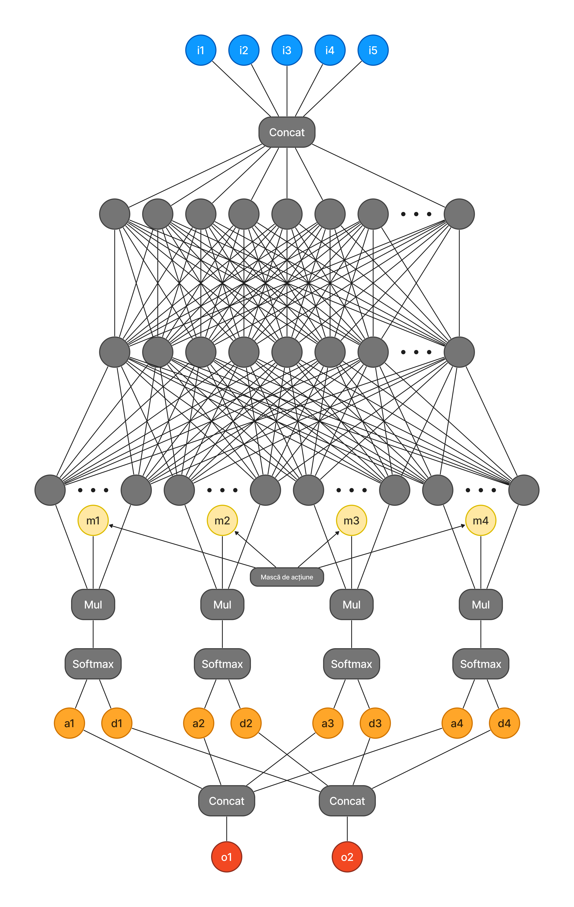

This project explores the training process and the robustness of a forklift agent in a simulated environment. Using Deep Reinforcement Learning, Imitation Learning, and Curriculum Learning, the agent is designed to navigate, maneuver, and accurately transport packages through a warehouse.

|  |
|:--:|
| *Forklift lifting a pallet.* |

Observations and Actions: The agent gathers observations about the state of the environment and performs discrete actions such as accelerating, steering, and moving the fork. The observations include data about the distance to objects, detected through proximity sensors.

|  |
|:--:|
| *Large red spheres that detect the wall, medium yellow spheres that detect the checkpoint.* |

|  |
|:--:|
| *Sphere cast from the tips of the forks inside the pallets.* |

Learning Techniques: The agent uses Proximal Policy Optimization for training, combined with imitation learning to learn from human demonstrations. PPO is efficient for training due to its ability to keep policy changes within safe limits. In addition, curriculum learning is used to teach the agent increasingly complex behaviors, allowing it to progress from simple tasks to more complex ones in a gradual and effective way.

|  |
|:--:|
| *Early termination: the episode ends sooner when the agent makes a very good or very poor decision.* |

The input layers of the network represent the agent's observations described earlier. The first and third observations consist of batches of 175 and 125 floats, respectively. These variables are essentially the concatenation of the observations from the first two 3D Ray Perception Sensors. The second and fourth observations both have a size of 54 and represent 54 float values obtained from the 3D Ray Perception Sensor components at the tips of the forks.
The fifth observation is a batch of 5 custom values, manually configured for the forklift. 
These observations are normalized and concatenated into a single vector, after which two fully connected hidden layers with 128 units (neurons) each follow, as specified in the network configuration file. Sigmoid activation functions are applied after each layer.
The last hidden layer is connected to 4 parallel Gemm layers, whose output is multiplied by the value at the corresponding index in the action mask, passed through a softmax, which produces two outputs: the probabilities for the discrete actions and the deterministic probabilities for the discrete actions. These are each concatenated into two vectors.

|  |
|:--:|
| *Neural network architecture: The input layer consists of the top row, and the output is represented by the vectors o1 and o2, which contain the discrete actions and the deterministic discrete actions, respectively.* |
